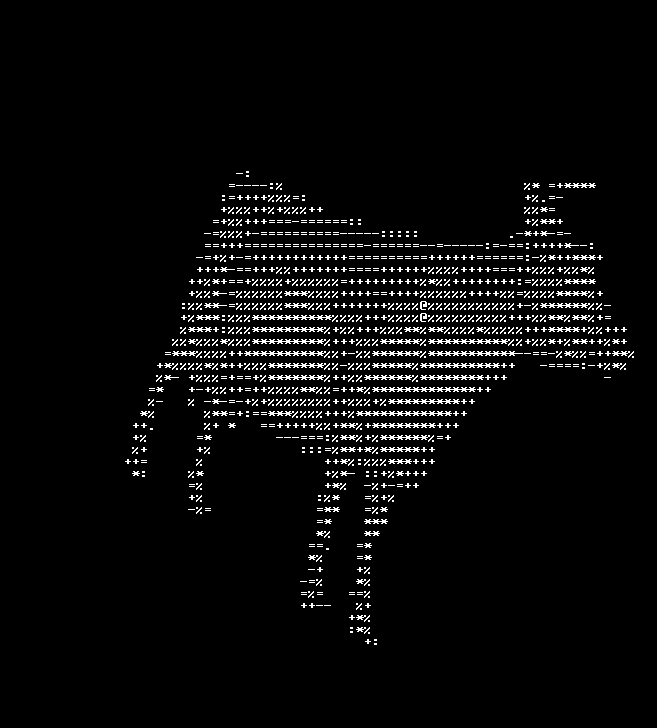

# CLI Renderer

A simple C++ application that renders 3D models (.obj files) directly into the Windows command line interface. It uses ASCII characters to represent the geometry, providing a text-based visualization of 3D objects.

This project is configured as a Visual Studio solution and uses the **GLM (OpenGL Mathematics)** library for handling 3D transformations.

## Example Output

## Features

*   Renders 3D models in the Windows console.
*   Loads model geometry from standard `.obj` files.
*   Uses ASCII character ramping for basic shading effects.
*   Basic camera controls for model rotation.

## Technology Stack

*   **C++:** Core application logic.
*   **Visual Studio 2022:** The project is set up as a Visual Studio solution (`.sln`).
*   **GLM (OpenGL Mathematics):** A header-only C++ mathematics library for graphics software.

## Prerequisites

*   Windows Operating System
*   Visual Studio (with the "Desktop development with C++" workload installed)
*   Git

## Dependencies

*   **[GLM (OpenGL Mathematics)](https://github.com/g-truc/glm)**: Included as a Git submodule.
*   **OBJ_Loader.h**: A simple, header-only OBJ file loader, included directly in the repository.
